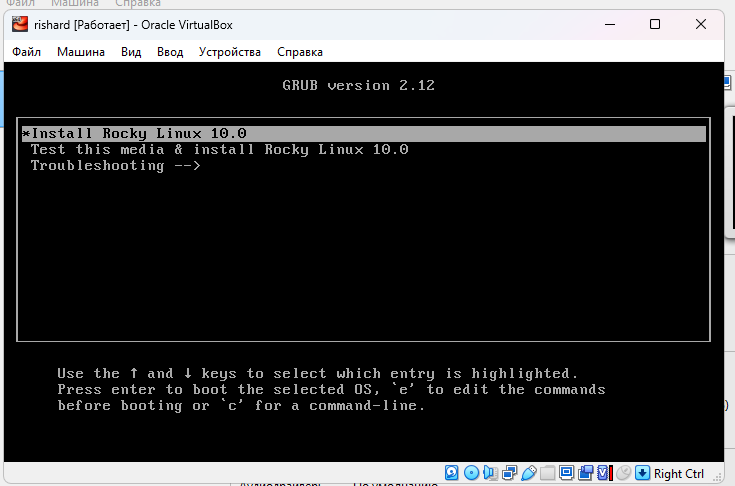
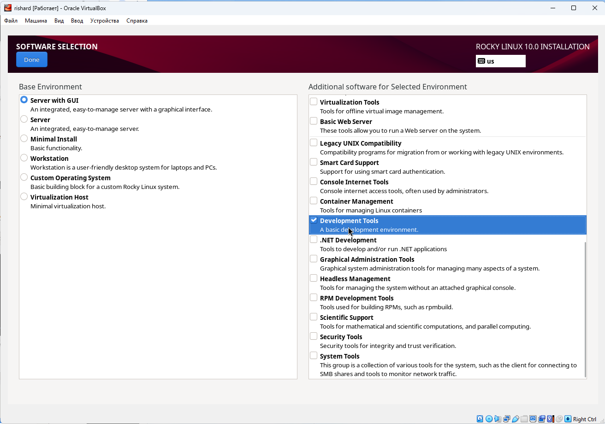
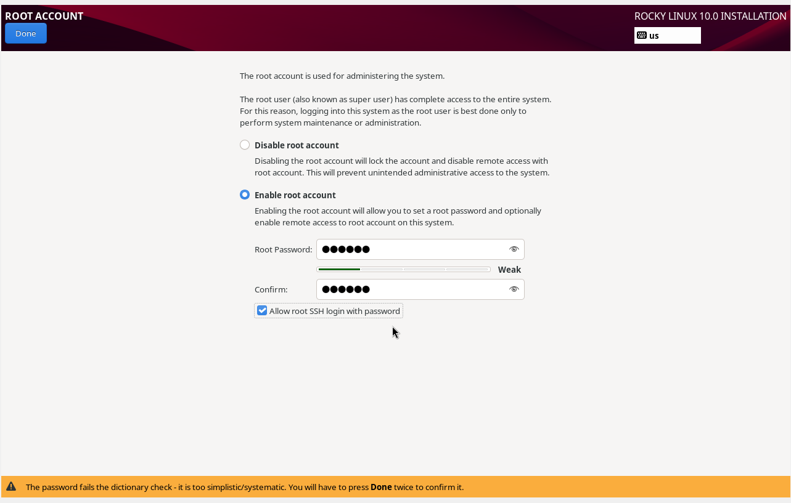
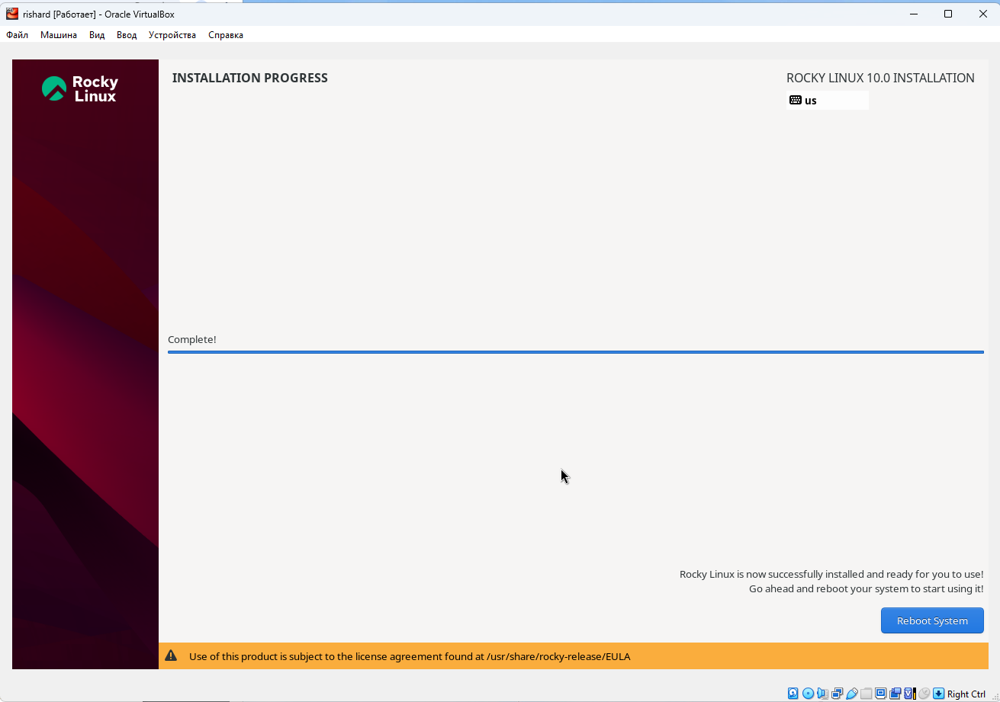
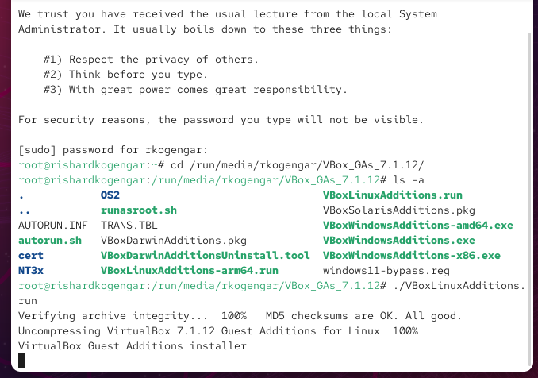
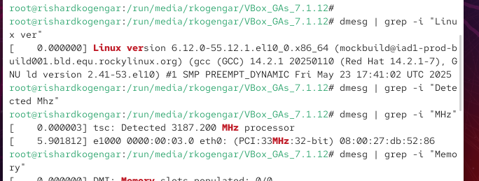
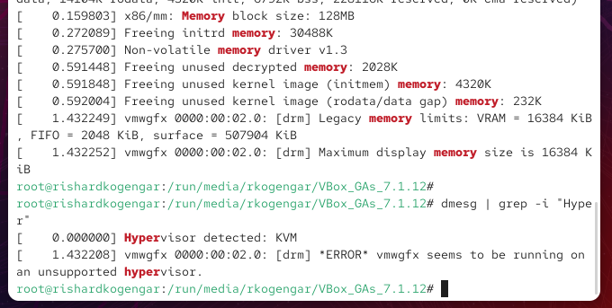
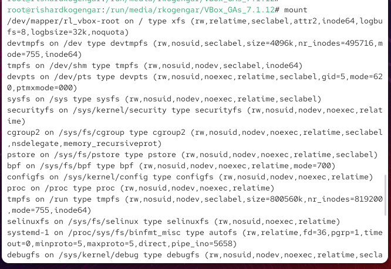

---
## Front matter
lang: ru-RU
title: Лабораторная работа №1
subtitle: Установка Rocky Linux в VirtualBox
author:
  - Ришард Когенгар
institute:
  - Российский университет дружбы народов, Москва, Россия
date: 2 сентября 2025

## i18n babel
babel-lang: russian
babel-otherlangs: english

## Formatting pdf
toc: false
slide_level: 2
aspectratio: 169
section-titles: true
theme: metropolis
header-includes:
 - \metroset{progressbar=frametitle,sectionpage=progressbar,numbering=fraction}
---

# Цель работы

## Основная цель

Установить Rocky Linux в VirtualBox, создать пользователя и проверить работу системы.

# Ход выполнения работы

## Создание виртуальной машины

{ #fig:001 width=70% }

## Настройка жёсткого диска

{ #fig:002 width=70% }

## Запуск установщика

{ #fig:003 width=70% }

## Выбор языка установки

{ #fig:004 width=70% }

## Настройка клавиатуры

{ #fig:005 width=70% }

## Выбор окружения

{ #fig:006 width=70% }

## Установка пароля root

{ #fig:007 width=70% }

## Создание пользователя

{ #fig:008 width=70% }

## Обзор параметров и установка

{ #fig:009 width=70% }

## Ход установки системы

{ #fig:010 width=70% }

## Установка дополнений VirtualBox

{ #fig:011 width=70% }

# Анализ системы

## Версия ядра и процессор

{ #fig:012 width=70% }

## Проверка гипервизора

{ #fig:013 width=70% }

## Смонтированные файловые системы

{ #fig:014 width=70% }

# Итоги работы

## Вывод

Rocky Linux установлен в VirtualBox. Создан root и пользователь, настроена клавиатура, добавлены Guest Additions. Система работает правильно и готова к использованию.

