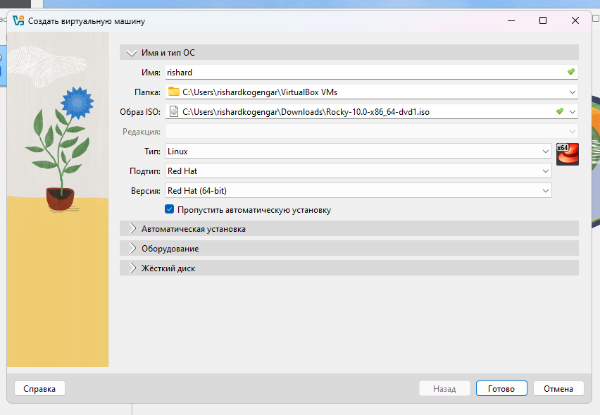
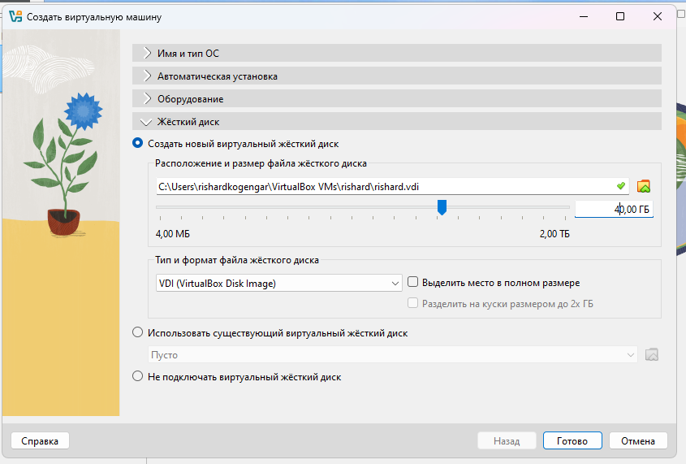
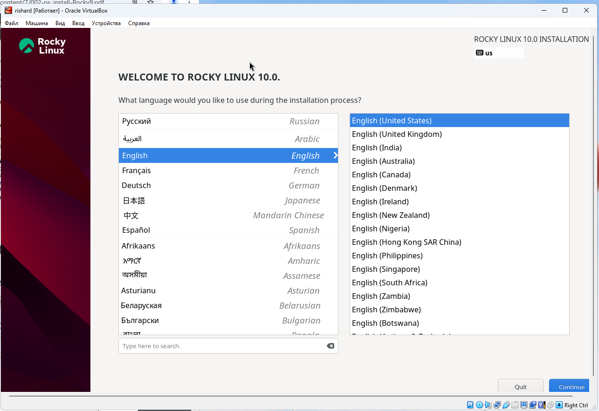
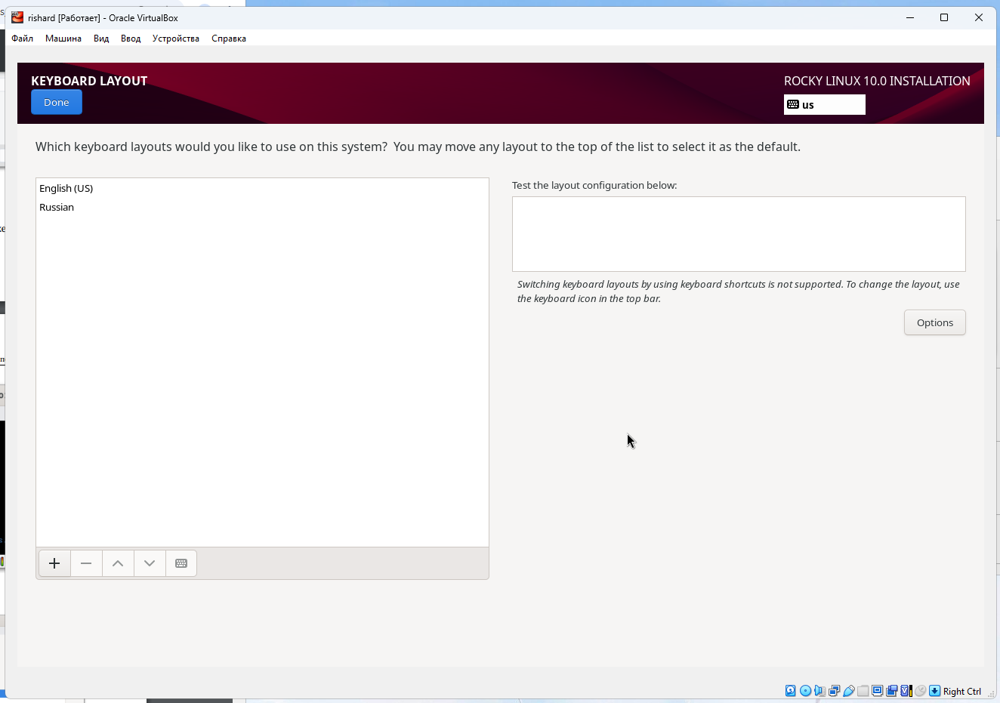
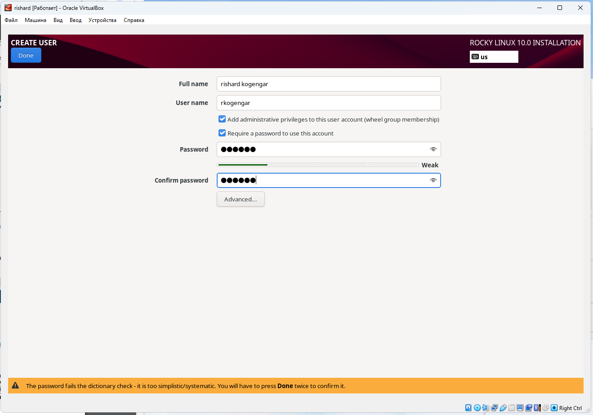
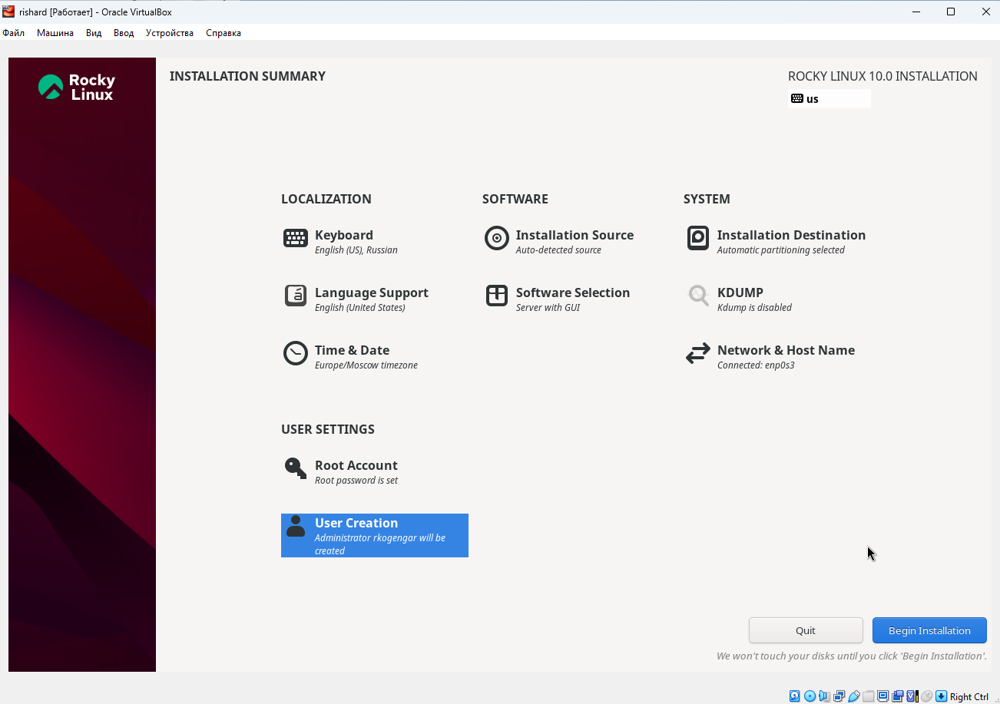

---
## Front matter
title: "Отчёт по лабораторной работе №1"
subtitle: "Установка Rocky Linux в VirtualBox"
author: "Ришард Когенгар"

## Generic otions
lang: ru-RU
toc-title: "Содержание"

## Bibliography
bibliography: bib/cite.bib
csl: pandoc/csl/gost-r-7-0-5-2008-numeric.csl

## Pdf output format
toc: true
toc-depth: 2
lof: true
lot: true
fontsize: 12pt
linestretch: 1.5
papersize: a4
documentclass: scrreprt
## I18n polyglossia
polyglossia-lang:
  name: russian
  options:
    - spelling=modern
    - babelshorthands=true
polyglossia-otherlangs:
  name: english
## I18n babel
babel-lang: russian
babel-otherlangs: english
## Fonts
mainfont: IBM Plex Serif
romanfont: IBM Plex Serif
sansfont: IBM Plex Sans
monofont: IBM Plex Mono
mathfont: STIX Two Math
mainfontoptions: Ligatures=Common,Ligatures=TeX,Scale=0.94
romanfontoptions: Ligatures=Common,Ligatures=TeX,Scale=0.94
sansfontoptions: Ligatures=Common,Ligatures=TeX,Scale=MatchLowercase,Scale=0.94
monofontoptions: Scale=MatchLowercase,Scale=0.94,FakeStretch=0.9
mathfontoptions:
## Biblatex
biblatex: true
biblio-style: "gost-numeric"
biblatexoptions:
  - parentracker=true
  - backend=biber
  - hyperref=auto
  - language=auto
  - autolang=other*
  - citestyle=gost-numeric
## Pandoc-crossref LaTeX customization
figureTitle: "Рис."
tableTitle: "Таблица"
listingTitle: "Листинг"
lofTitle: "Список иллюстраций"
lotTitle: "Список таблиц"
lolTitle: "Листинги"
## Misc options
indent: true
header-includes:
  - \usepackage{indentfirst}
  - \usepackage{float}
  - \floatplacement{figure}{H}
---

# Цель работы

Цель – установить систему Rocky Linux в VirtualBox и проверить, что она работает.

# Ход выполнения

Я создал новую виртуальную машину и подключил ISO файл (рис. [@fig:001]).

{ #fig:001 width=70% }

Потом сделал виртуальный жёсткий диск на 40 ГБ (рис. [@fig:002]).

{ #fig:002 width=70% }

После этого загрузил установщик Rocky Linux (рис. [@fig:003]).

{ #fig:003 width=70% }

Дальше выбрал английский язык (рис. [@fig:004]).

{ #fig:004 width=70% }

Добавил раскладки клавиатуры: английскую и русскую (рис. [@fig:005]).

{ #fig:005 width=70% }

Затем выбрал вариант установки **Server with GUI** и пакет **Development Tools** (рис. [@fig:006]).

{ #fig:006 width=70% }

Поставил пароль для root и разрешил вход по паролю (рис. [@fig:007]).

{ #fig:007 width=70% }

Создал обычного пользователя с правами администратора (рис. [@fig:008]).

{ #fig:008 width=70% }

После всех настроек запустил установку (рис. [@fig:009]).

{ #fig:009 width=70% }

Когда установка закончилась, система попросила перезагрузку (рис. [@fig:010]).

{ #fig:010 width=70% }

Дальше я установил **Guest Additions** для удобной работы в VirtualBox (рис. [@fig:011]).

{ #fig:011 width=70% }

Проверил версию ядра и параметры процессора (рис. [@fig:012]).

{ #fig:012 width=70% }

Система определила гипервизор KVM (рис. [@fig:013]).

{ #fig:013 width=70% }

Также посмотрел список смонтированных файловых систем (рис. [@fig:014]).

{ #fig:014 width=70% }

# Контрольные вопросы

1. **Основные команды в Linux**  
   - `man`, `--help` — помощь  
   - `cd`, `pwd` — работа с папками  
   - `ls`, `dir` — список файлов  
   - `touch`, `mkdir`, `rm` — создать и удалить файлы или папки  
   - `chmod`, `chown` — изменить права доступа  
   - `history` — история команд

2. **Учётная запись пользователя**  
   В неё входят имя, UID, GID, домашняя папка и оболочка (shell). Данные хранятся в файлах `/etc/passwd`, `/etc/shadow`, `/etc/group`.

3. **Файловые системы**  
   - Ext4 — стандарт в Linux  
   - XFS — для больших файлов  
   - Btrfs — поддержка снапшотов  
   - NTFS — обычно для Windows

4. **Как посмотреть смонтированные разделы**  
   Использовать команды: `mount`, `df -h`, `lsblk`.

5. **Как завершить зависший процесс**  
   Сначала найти его через `ps aux` или `top`. Потом завершить с помощью `kill -9 PID`.

# Заключение

Я успешно установил Rocky Linux в VirtualBox. Система запускается, работает графический интерфейс, root и пользователь. Теперь я умею создавать виртуальные машины, ставить Linux и настраивать окружение.

